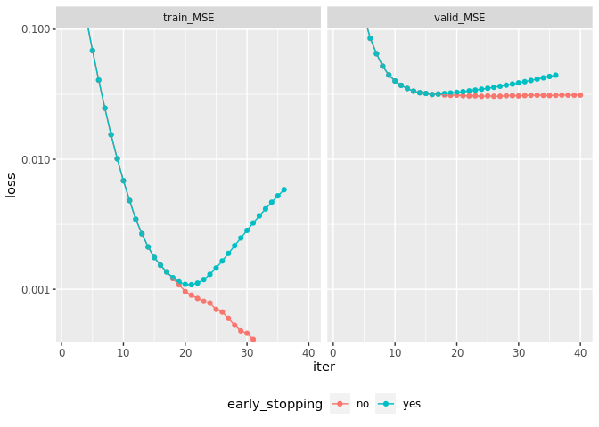

xgboost early stopping
================
Lutz Gruber
2022-05-03

``` r
set.seed(987654)
df = tibble::tibble(
  x = rnorm(100),
  y = x + rnorm(100, sd = .1)
)

training_rows = sample(x = nrow(df), size = .8 * nrow(df))

dm = xgboost::xgb.DMatrix(
  data = as.matrix(df |> dplyr::select(x)),
  label = df$y
)

dm_train = xgboost::slice(dm, training_rows)
dm_valid = xgboost::slice(dm, setdiff(1:nrow(df), training_rows))

set.seed(123)
mdl_early_stopping = xgboost::xgb.train(
  obj = function(preds, dtrain) {
    message("obj([", paste0(preds[1:5], collapse = ", "), ", ...])")
    
    residual = preds - xgboost::getinfo(dtrain, "label")
    
    return(
      list(
        grad = 2 * residual,
        hess = 2 * rep(1, length(residual))
      )
    )
  },
  feval = function(preds, dtrain) {
    message("feval([", paste0(preds[1:5], collapse = ", "), ", ...])")
    
    residual = preds - xgboost::getinfo(dtrain, "label")
    
    return(
      list(
        metric = "MSE",
        value = mean(residual^2)
      )
    )
  },
  data = dm_train,
  watchlist = list(train = dm_train, valid = dm_valid),
  nrounds = 40,
  early_stopping_rounds = 20,
  maximize = FALSE
)
```

    ## obj([0.5, 0.5, 0.5, 0.5, 0.5, ...])

    ## feval([0.373729348182678, 0.165775835514069, -0.0278137922286987, 0.440069615840912, 0.440069615840912, ...])

    ## feval([0.613246977329254, -0.0278137922286987, 0.165775835514069, 0.373729348182678, 0.707814037799835, ...])

    ## [1]  train-MSE:0.737490  valid-MSE:1.058683 
    ## Multiple eval metrics are present. Will use valid_MSE for early stopping.
    ## Will train until valid_MSE hasn't improved in 20 rounds.

    ## obj([0.373729348182678, 0.165775835514069, -0.0278137922286987, 0.440069615840912, 0.440069615840912, ...])

    ## feval([0.282814502716064, -0.187725454568863, -0.563233971595764, 0.396735370159149, 0.396735370159149, ...])

    ## feval([0.697969257831573, -0.563233971595764, -0.0610337108373642, 0.282814502716064, 0.878318428993225, ...])

    ## [2]  train-MSE:0.394739  valid-MSE:0.573552

    ## obj([0.282814502716064, -0.187725454568863, -0.563233971595764, 0.396735370159149, 0.396735370159149, ...])

    ## feval([0.21735580265522, -0.454122006893158, -0.829630494117737, 0.36261248588562, 0.36261248588562, ...])

    ## feval([0.802395820617676, -0.829630494117737, -0.240597084164619, 0.21735580265522, 0.982744991779327, ...])

    ## [3]  train-MSE:0.216343  valid-MSE:0.335281

    ## obj([0.21735580265522, -0.454122006893158, -0.829630494117737, 0.36261248588562, 0.36261248588562, ...])

    ## feval([0.159699022769928, -0.652520000934601, -1.02802848815918, 0.337795853614807, 0.337795853614807, ...])

    ## feval([0.845099747180939, -1.02802848815918, -0.361831784248352, 0.159699022769928, 1.08726596832275, ...])

    ## [4]  train-MSE:0.120225  valid-MSE:0.197644

    ## obj([0.159699022769928, -0.652520000934601, -1.02802848815918, 0.337795853614807, 0.337795853614807, ...])

    ## feval([0.140084534883499, -0.754504323005676, -1.17935132980347, 0.316547363996506, 0.32783716917038, ...])

    ## feval([0.876565098762512, -1.17935132980347, -0.463816106319427, 0.140084534883499, 1.16670191287994, ...])

    ## [5]  train-MSE:0.068548  valid-MSE:0.125786

    ## obj([0.140084534883499, -0.754504323005676, -1.17935132980347, 0.316547363996506, 0.32783716917038, ...])

    ## feval([0.139342337846756, -0.825630843639374, -1.28584063053131, 0.303877025842667, 0.315166831016541, ...])

    ## feval([0.900602400302887, -1.28584063053131, -0.534942626953125, 0.139342337846756, 1.24572563171387, ...])

    ## [6]  train-MSE:0.040672  valid-MSE:0.085161

    ## obj([0.139342337846756, -0.825630843639374, -1.28584063053131, 0.303877025842667, 0.315166831016541, ...])

    ## feval([0.114785224199295, -0.873264610767365, -1.36611652374268, 0.290771692991257, 0.302061498165131, ...])

    ## feval([0.917909264564514, -1.36611652374268, -0.582576394081116, 0.114785224199295, 1.30894458293915, ...])

    ## [7]  train-MSE:0.024756  valid-MSE:0.064849

    ## obj([0.114785224199295, -0.873264610767365, -1.36611652374268, 0.290771692991257, 0.302061498165131, ...])

    ## feval([0.101512096822262, -0.914940416812897, -1.42981350421906, 0.277498573064804, 0.302675187587738, ...])

    ## feval([0.93400502204895, -1.42981350421906, -0.624252200126648, 0.101512096822262, 1.3595198392868, ...])

    ## [8]  train-MSE:0.015438  valid-MSE:0.052011

    ## obj([0.101512096822262, -0.914940416812897, -1.42981350421906, 0.277498573064804, 0.302675187587738, ...])

    ## feval([0.0876996219158173, -0.951461255550385, -1.46633434295654, 0.259741395711899, 0.305584877729416, ...])

    ## feval([0.941378176212311, -1.46633434295654, -0.660773038864136, 0.0876996219158173, 1.3999799489975, ...])

    ## [9]  train-MSE:0.010089  valid-MSE:0.044496

    ## obj([0.0876996219158173, -0.951461255550385, -1.46633434295654, 0.259741395711899, 0.305584877729416, ...])

    ## feval([0.0813888907432556, -0.974853992462158, -1.49994194507599, 0.253430664539337, 0.306243091821671, ...])

    ## feval([0.948739230632782, -1.49994194507599, -0.684165775775909, 0.0813888907432556, 1.43234813213348, ...])

    ## [10] train-MSE:0.006833  valid-MSE:0.040041

    ## obj([0.0813888907432556, -0.974853992462158, -1.49994194507599, 0.253430664539337, 0.306243091821671, ...])

    ## feval([0.076783575117588, -0.992400050163269, -1.52458143234253, 0.248825341463089, 0.301637768745422, ...])

    ## feval([0.930562496185303, -1.52458143234253, -0.70171183347702, 0.076783575117588, 1.45824265480042, ...])

    ## [11] train-MSE:0.004814  valid-MSE:0.037039

    ## obj([0.076783575117588, -0.992400050163269, -1.52458143234253, 0.248825341463089, 0.301637768745422, ...])

    ## feval([0.088701568543911, -1.00411486625671, -1.53629624843597, 0.248711600899696, 0.301524043083191, ...])

    ## feval([0.936647415161133, -1.53629624843597, -0.713426649570465, 0.088701568543911, 1.4789582490921, ...])

    ## [12] train-MSE:0.003458  valid-MSE:0.035052

    ## obj([0.088701568543911, -1.00411486625671, -1.53629624843597, 0.248711600899696, 0.301524043083191, ...])

    ## feval([0.0843672081828117, -1.00844919681549, -1.55184841156006, 0.250278532505035, 0.303090959787369, ...])

    ## feval([0.920889019966125, -1.55184841156006, -0.717760980129242, 0.0843672081828117, 1.49553072452545, ...])

    ## [13] train-MSE:0.002673  valid-MSE:0.033412

    ## obj([0.0843672081828117, -1.00844919681549, -1.55184841156006, 0.250278532505035, 0.303090959787369, ...])

    ## feval([0.0840484574437141, -1.01422202587128, -1.55762124061584, 0.249959781765938, 0.302772223949432, ...])

    ## feval([0.908282279968262, -1.55762124061584, -0.723533749580383, 0.0840484574437141, 1.50878870487213, ...])

    ## [14] train-MSE:0.002116  valid-MSE:0.032495

    ## obj([0.0840484574437141, -1.01422202587128, -1.55762124061584, 0.249959781765938, 0.302772223949432, ...])

    ## feval([0.081622451543808, -1.01664805412292, -1.56898045539856, 0.247533768415451, 0.300346225500107, ...])

    ## feval([0.910750329494476, -1.56898045539856, -0.725959777832031, 0.081622451543808, 1.5112566947937, ...])

    ## [15] train-MSE:0.001756  valid-MSE:0.032091

    ## obj([0.081622451543808, -1.01664805412292, -1.56898045539856, 0.247533768415451, 0.300346225500107, ...])

    ## feval([0.0806029066443443, -1.01915216445923, -1.57148456573486, 0.235769554972649, 0.300177901983261, ...])

    ## feval([0.911805093288422, -1.57148456573486, -0.728463888168335, 0.0806029066443443, 1.52136945724487, ...])

    ## [16] train-MSE:0.001530  valid-MSE:0.031506

    ## obj([0.0806029066443443, -1.01915216445923, -1.57148456573486, 0.235769554972649, 0.300177901983261, ...])

    ## feval([0.0806249976158142, -1.02816927433014, -1.57601487636566, 0.235791638493538, 0.30019998550415, ...])

    ## feval([0.911827206611633, -1.57601487636566, -0.718195796012878, 0.0806249976158142, 1.52139151096344, ...])

    ## [17] train-MSE:0.001360  valid-MSE:0.031743

    ## obj([0.0806029066443443, -1.01915216445923, -1.57148456573486, 0.235769554972649, 0.300177901983261, ...])

    ## feval([0.0806470885872841, -1.03718638420105, -1.58054518699646, 0.235813722014427, 0.30022206902504, ...])

    ## feval([0.911849319934845, -1.58054518699646, -0.707927703857422, 0.0806470885872841, 1.52141356468201, ...])

    ## [18] train-MSE:0.001230  valid-MSE:0.032024

    ## obj([0.0806029066443443, -1.01915216445923, -1.57148456573486, 0.235769554972649, 0.300177901983261, ...])

    ## feval([0.080669179558754, -1.04620349407196, -1.58507549762726, 0.235835805535316, 0.300244152545929, ...])

    ## feval([0.911871433258057, -1.58507549762726, -0.697659611701965, 0.080669179558754, 1.52143561840057, ...])

    ## [19] train-MSE:0.001140  valid-MSE:0.032347

    ## obj([0.0806029066443443, -1.01915216445923, -1.57148456573486, 0.235769554972649, 0.300177901983261, ...])

    ## feval([0.0806912705302238, -1.05522060394287, -1.58960580825806, 0.235857889056206, 0.300266236066818, ...])

    ## feval([0.911893546581268, -1.58960580825806, -0.687391519546509, 0.0806912705302238, 1.52145767211914, ...])

    ## [20] train-MSE:0.001091  valid-MSE:0.032713

    ## obj([0.0806029066443443, -1.01915216445923, -1.57148456573486, 0.235769554972649, 0.300177901983261, ...])

    ## feval([0.0807133615016937, -1.06423771381378, -1.59413611888885, 0.235879972577095, 0.300288319587708, ...])

    ## feval([0.91191565990448, -1.59413611888885, -0.677123427391052, 0.0807133615016937, 1.52147972583771, ...])

    ## [21] train-MSE:0.001083  valid-MSE:0.033121

    ## obj([0.0806029066443443, -1.01915216445923, -1.57148456573486, 0.235769554972649, 0.300177901983261, ...])

    ## feval([0.0807354524731636, -1.07325482368469, -1.59866642951965, 0.235902056097984, 0.300310403108597, ...])

    ## feval([0.911937773227692, -1.59866642951965, -0.666855335235596, 0.0807354524731636, 1.52150177955627, ...])

    ## [22] train-MSE:0.001116  valid-MSE:0.033572

    ## obj([0.0806029066443443, -1.01915216445923, -1.57148456573486, 0.235769554972649, 0.300177901983261, ...])

    ## feval([0.0807575434446335, -1.0822719335556, -1.60319674015045, 0.235924139618874, 0.300332486629486, ...])

    ## feval([0.911959886550903, -1.60319674015045, -0.656587243080139, 0.0807575434446335, 1.52152383327484, ...])

    ## [23] train-MSE:0.001189  valid-MSE:0.034066

    ## obj([0.0806029066443443, -1.01915216445923, -1.57148456573486, 0.235769554972649, 0.300177901983261, ...])

    ## feval([0.0807796344161034, -1.09128904342651, -1.60772705078125, 0.235946223139763, 0.300354570150375, ...])

    ## feval([0.911981999874115, -1.60772705078125, -0.646319150924683, 0.0807796344161034, 1.52154588699341, ...])

    ## [24] train-MSE:0.001302  valid-MSE:0.034603

    ## obj([0.0806029066443443, -1.01915216445923, -1.57148456573486, 0.235769554972649, 0.300177901983261, ...])

    ## feval([0.0808017253875732, -1.10030615329742, -1.61225736141205, 0.235968306660652, 0.300376653671265, ...])

    ## feval([0.912004113197327, -1.61225736141205, -0.636051058769226, 0.0808017253875732, 1.52156794071198, ...])

    ## [25] train-MSE:0.001457  valid-MSE:0.035182

    ## obj([0.0806029066443443, -1.01915216445923, -1.57148456573486, 0.235769554972649, 0.300177901983261, ...])

    ## feval([0.0808238163590431, -1.10932326316833, -1.61678767204285, 0.235990390181541, 0.300398737192154, ...])

    ## feval([0.912026226520538, -1.61678767204285, -0.62578296661377, 0.0808238163590431, 1.52158999443054, ...])

    ## [26] train-MSE:0.001652  valid-MSE:0.035804

    ## obj([0.0806029066443443, -1.01915216445923, -1.57148456573486, 0.235769554972649, 0.300177901983261, ...])

    ## feval([0.080845907330513, -1.11834037303925, -1.62131798267365, 0.236012473702431, 0.300420820713043, ...])

    ## feval([0.91204833984375, -1.62131798267365, -0.615514874458313, 0.080845907330513, 1.52161204814911, ...])

    ## [27] train-MSE:0.001887  valid-MSE:0.036469

    ## obj([0.0806029066443443, -1.01915216445923, -1.57148456573486, 0.235769554972649, 0.300177901983261, ...])

    ## feval([0.0808679983019829, -1.12735748291016, -1.62584829330444, 0.23603455722332, 0.300442904233932, ...])

    ## feval([0.912070453166962, -1.62584829330444, -0.605246782302856, 0.0808679983019829, 1.52163410186768, ...])

    ## [28] train-MSE:0.002163  valid-MSE:0.037177

    ## obj([0.0806029066443443, -1.01915216445923, -1.57148456573486, 0.235769554972649, 0.300177901983261, ...])

    ## feval([0.0808900892734528, -1.13637459278107, -1.63037860393524, 0.236056640744209, 0.300464987754822, ...])

    ## feval([0.912092566490173, -1.63037860393524, -0.5949786901474, 0.0808900892734528, 1.52165615558624, ...])

    ## [29] train-MSE:0.002480  valid-MSE:0.037927

    ## obj([0.0806029066443443, -1.01915216445923, -1.57148456573486, 0.235769554972649, 0.300177901983261, ...])

    ## feval([0.0809121802449226, -1.14539170265198, -1.63490891456604, 0.236078724265099, 0.300487071275711, ...])

    ## feval([0.912114679813385, -1.63490891456604, -0.584710597991943, 0.0809121802449226, 1.52167820930481, ...])

    ## [30] train-MSE:0.002837  valid-MSE:0.038720

    ## obj([0.0806029066443443, -1.01915216445923, -1.57148456573486, 0.235769554972649, 0.300177901983261, ...])

    ## feval([0.0809342712163925, -1.15440881252289, -1.63943922519684, 0.236100807785988, 0.3005091547966, ...])

    ## feval([0.912136793136597, -1.63943922519684, -0.574442505836487, 0.0809342712163925, 1.52170026302338, ...])

    ## [31] train-MSE:0.003235  valid-MSE:0.039556

    ## obj([0.0806029066443443, -1.01915216445923, -1.57148456573486, 0.235769554972649, 0.300177901983261, ...])

    ## feval([0.0809563621878624, -1.1634259223938, -1.64396953582764, 0.236122891306877, 0.30053123831749, ...])

    ## feval([0.912158906459808, -1.64396953582764, -0.56417441368103, 0.0809563621878624, 1.52172231674194, ...])

    ## [32] train-MSE:0.003674  valid-MSE:0.040434

    ## obj([0.0806029066443443, -1.01915216445923, -1.57148456573486, 0.235769554972649, 0.300177901983261, ...])

    ## feval([0.0809784531593323, -1.17244303226471, -1.64849984645844, 0.236144974827766, 0.300553321838379, ...])

    ## feval([0.91218101978302, -1.64849984645844, -0.553906321525574, 0.0809784531593323, 1.52174437046051, ...])

    ## [33] train-MSE:0.004153  valid-MSE:0.041355

    ## obj([0.0806029066443443, -1.01915216445923, -1.57148456573486, 0.235769554972649, 0.300177901983261, ...])

    ## feval([0.0810005441308022, -1.18146014213562, -1.65303015708923, 0.236167058348656, 0.300575405359268, ...])

    ## feval([0.912203133106232, -1.65303015708923, -0.543638229370117, 0.0810005441308022, 1.52176642417908, ...])

    ## [34] train-MSE:0.004673  valid-MSE:0.042319

    ## obj([0.0806029066443443, -1.01915216445923, -1.57148456573486, 0.235769554972649, 0.300177901983261, ...])

    ## feval([0.081022635102272, -1.19047725200653, -1.65756046772003, 0.236189141869545, 0.300597488880157, ...])

    ## feval([0.912225246429443, -1.65756046772003, -0.533370137214661, 0.081022635102272, 1.52178847789764, ...])

    ## [35] train-MSE:0.005234  valid-MSE:0.043326

    ## obj([0.0806029066443443, -1.01915216445923, -1.57148456573486, 0.235769554972649, 0.300177901983261, ...])

    ## feval([0.0810447260737419, -1.19949436187744, -1.66209077835083, 0.236211225390434, 0.300619572401047, ...])

    ## feval([0.912247359752655, -1.66209077835083, -0.523102045059204, 0.0810447260737419, 1.52181053161621, ...])

    ## [36] train-MSE:0.005835  valid-MSE:0.044375 
    ## Stopping. Best iteration:
    ## [16] train-MSE:0.001530  valid-MSE:0.031506

``` r
set.seed(123)
mdl_full = xgboost::xgb.train(
  obj = function(preds, dtrain) {
    message("obj([", paste0(preds[1:5], collapse = ", "), ", ...])")
    
    residual = preds - xgboost::getinfo(dtrain, "label")
    
    return(
      list(
        grad = 2 * residual,
        hess = 2 * rep(1, length(residual))
      )
    )
  },
  feval = function(preds, dtrain) {
    message("feval([", paste0(preds[1:5], collapse = ", "), ", ...])")
    
    residual = preds - xgboost::getinfo(dtrain, "label")
    
    return(
      list(
        metric = "MSE",
        value = mean(residual^2)
      )
    )
  },
  data = dm_train,
  watchlist = list(train = dm_train, valid = dm_valid),
  nrounds = 40
)
```

    ## obj([0.5, 0.5, 0.5, 0.5, 0.5, ...])

    ## feval([0.373729348182678, 0.165775835514069, -0.0278137922286987, 0.440069615840912, 0.440069615840912, ...])

    ## feval([0.613246977329254, -0.0278137922286987, 0.165775835514069, 0.373729348182678, 0.707814037799835, ...])

    ## [1]  train-MSE:0.737490  valid-MSE:1.058683

    ## obj([0.373729348182678, 0.165775835514069, -0.0278137922286987, 0.440069615840912, 0.440069615840912, ...])

    ## feval([0.282814502716064, -0.187725454568863, -0.563233971595764, 0.396735370159149, 0.396735370159149, ...])

    ## feval([0.697969257831573, -0.563233971595764, -0.0610337108373642, 0.282814502716064, 0.878318428993225, ...])

    ## [2]  train-MSE:0.394739  valid-MSE:0.573552

    ## obj([0.282814502716064, -0.187725454568863, -0.563233971595764, 0.396735370159149, 0.396735370159149, ...])

    ## feval([0.21735580265522, -0.454122006893158, -0.829630494117737, 0.36261248588562, 0.36261248588562, ...])

    ## feval([0.802395820617676, -0.829630494117737, -0.240597084164619, 0.21735580265522, 0.982744991779327, ...])

    ## [3]  train-MSE:0.216343  valid-MSE:0.335281

    ## obj([0.21735580265522, -0.454122006893158, -0.829630494117737, 0.36261248588562, 0.36261248588562, ...])

    ## feval([0.159699022769928, -0.652520000934601, -1.02802848815918, 0.337795853614807, 0.337795853614807, ...])

    ## feval([0.845099747180939, -1.02802848815918, -0.361831784248352, 0.159699022769928, 1.08726596832275, ...])

    ## [4]  train-MSE:0.120225  valid-MSE:0.197644

    ## obj([0.159699022769928, -0.652520000934601, -1.02802848815918, 0.337795853614807, 0.337795853614807, ...])

    ## feval([0.140084534883499, -0.754504323005676, -1.17935132980347, 0.316547363996506, 0.32783716917038, ...])

    ## feval([0.876565098762512, -1.17935132980347, -0.463816106319427, 0.140084534883499, 1.16670191287994, ...])

    ## [5]  train-MSE:0.068548  valid-MSE:0.125786

    ## obj([0.140084534883499, -0.754504323005676, -1.17935132980347, 0.316547363996506, 0.32783716917038, ...])

    ## feval([0.139342337846756, -0.825630843639374, -1.28584063053131, 0.303877025842667, 0.315166831016541, ...])

    ## feval([0.900602400302887, -1.28584063053131, -0.534942626953125, 0.139342337846756, 1.24572563171387, ...])

    ## [6]  train-MSE:0.040672  valid-MSE:0.085161

    ## obj([0.139342337846756, -0.825630843639374, -1.28584063053131, 0.303877025842667, 0.315166831016541, ...])

    ## feval([0.114785224199295, -0.873264610767365, -1.36611652374268, 0.290771692991257, 0.302061498165131, ...])

    ## feval([0.917909264564514, -1.36611652374268, -0.582576394081116, 0.114785224199295, 1.30894458293915, ...])

    ## [7]  train-MSE:0.024756  valid-MSE:0.064849

    ## obj([0.114785224199295, -0.873264610767365, -1.36611652374268, 0.290771692991257, 0.302061498165131, ...])

    ## feval([0.101512096822262, -0.914940416812897, -1.42981350421906, 0.277498573064804, 0.302675187587738, ...])

    ## feval([0.93400502204895, -1.42981350421906, -0.624252200126648, 0.101512096822262, 1.3595198392868, ...])

    ## [8]  train-MSE:0.015438  valid-MSE:0.052011

    ## obj([0.101512096822262, -0.914940416812897, -1.42981350421906, 0.277498573064804, 0.302675187587738, ...])

    ## feval([0.0876996219158173, -0.951461255550385, -1.46633434295654, 0.259741395711899, 0.305584877729416, ...])

    ## feval([0.941378176212311, -1.46633434295654, -0.660773038864136, 0.0876996219158173, 1.3999799489975, ...])

    ## [9]  train-MSE:0.010089  valid-MSE:0.044496

    ## obj([0.0876996219158173, -0.951461255550385, -1.46633434295654, 0.259741395711899, 0.305584877729416, ...])

    ## feval([0.0813888907432556, -0.974853992462158, -1.49994194507599, 0.253430664539337, 0.306243091821671, ...])

    ## feval([0.948739230632782, -1.49994194507599, -0.684165775775909, 0.0813888907432556, 1.43234813213348, ...])

    ## [10] train-MSE:0.006833  valid-MSE:0.040041

    ## obj([0.0813888907432556, -0.974853992462158, -1.49994194507599, 0.253430664539337, 0.306243091821671, ...])

    ## feval([0.076783575117588, -0.992400050163269, -1.52458143234253, 0.248825341463089, 0.301637768745422, ...])

    ## feval([0.930562496185303, -1.52458143234253, -0.70171183347702, 0.076783575117588, 1.45824265480042, ...])

    ## [11] train-MSE:0.004814  valid-MSE:0.037039

    ## obj([0.076783575117588, -0.992400050163269, -1.52458143234253, 0.248825341463089, 0.301637768745422, ...])

    ## feval([0.088701568543911, -1.00411486625671, -1.53629624843597, 0.248711600899696, 0.301524043083191, ...])

    ## feval([0.936647415161133, -1.53629624843597, -0.713426649570465, 0.088701568543911, 1.4789582490921, ...])

    ## [12] train-MSE:0.003458  valid-MSE:0.035052

    ## obj([0.088701568543911, -1.00411486625671, -1.53629624843597, 0.248711600899696, 0.301524043083191, ...])

    ## feval([0.0843672081828117, -1.00844919681549, -1.55184841156006, 0.250278532505035, 0.303090959787369, ...])

    ## feval([0.920889019966125, -1.55184841156006, -0.717760980129242, 0.0843672081828117, 1.49553072452545, ...])

    ## [13] train-MSE:0.002673  valid-MSE:0.033412

    ## obj([0.0843672081828117, -1.00844919681549, -1.55184841156006, 0.250278532505035, 0.303090959787369, ...])

    ## feval([0.0840484574437141, -1.01422202587128, -1.55762124061584, 0.249959781765938, 0.302772223949432, ...])

    ## feval([0.908282279968262, -1.55762124061584, -0.723533749580383, 0.0840484574437141, 1.50878870487213, ...])

    ## [14] train-MSE:0.002116  valid-MSE:0.032495

    ## obj([0.0840484574437141, -1.01422202587128, -1.55762124061584, 0.249959781765938, 0.302772223949432, ...])

    ## feval([0.081622451543808, -1.01664805412292, -1.56898045539856, 0.247533768415451, 0.300346225500107, ...])

    ## feval([0.910750329494476, -1.56898045539856, -0.725959777832031, 0.081622451543808, 1.5112566947937, ...])

    ## [15] train-MSE:0.001756  valid-MSE:0.032091

    ## obj([0.081622451543808, -1.01664805412292, -1.56898045539856, 0.247533768415451, 0.300346225500107, ...])

    ## feval([0.0806029066443443, -1.01915216445923, -1.57148456573486, 0.235769554972649, 0.300177901983261, ...])

    ## feval([0.911805093288422, -1.57148456573486, -0.728463888168335, 0.0806029066443443, 1.52136945724487, ...])

    ## [16] train-MSE:0.001530  valid-MSE:0.031506

    ## obj([0.0806029066443443, -1.01915216445923, -1.57148456573486, 0.235769554972649, 0.300177901983261, ...])

    ## feval([0.0806249976158142, -1.02816927433014, -1.57601487636566, 0.235791638493538, 0.30019998550415, ...])

    ## feval([0.911827206611633, -1.57601487636566, -0.718195796012878, 0.0806249976158142, 1.52139151096344, ...])

    ## [17] train-MSE:0.001360  valid-MSE:0.031743

    ## obj([0.0806249976158142, -1.02816927433014, -1.57601487636566, 0.235791638493538, 0.30019998550415, ...])

    ## feval([0.08028195053339, -1.02851235866547, -1.57844340801239, 0.235448598861694, 0.299856930971146, ...])

    ## feval([0.901032865047455, -1.57844340801239, -0.718538820743561, 0.08028195053339, 1.52947735786438, ...])

    ## [18] train-MSE:0.001210  valid-MSE:0.031252

    ## obj([0.08028195053339, -1.02851235866547, -1.57844340801239, 0.235448598861694, 0.299856930971146, ...])

    ## feval([0.0794198587536812, -1.0293744802475, -1.57930552959442, 0.234586507081985, 0.298994839191437, ...])

    ## feval([0.904427945613861, -1.57930552959442, -0.719400942325592, 0.0794198587536812, 1.53287243843079, ...])

    ## [19] train-MSE:0.001082  valid-MSE:0.031043

    ## obj([0.0794198587536812, -1.0293744802475, -1.57930552959442, 0.234586507081985, 0.298994839191437, ...])

    ## feval([0.0908105969429016, -1.03047120571136, -1.58040225505829, 0.23533196747303, 0.29974028468132, ...])

    ## feval([0.905173420906067, -1.58040225505829, -0.720497727394104, 0.0908105969429016, 1.53361785411835, ...])

    ## [20] train-MSE:0.000961  valid-MSE:0.031157

    ## obj([0.0908105969429016, -1.03047120571136, -1.58040225505829, 0.23533196747303, 0.29974028468132, ...])

    ## feval([0.0904707834124565, -1.03081107139587, -1.5807421207428, 0.234992146492004, 0.299400478601456, ...])

    ## feval([0.895709812641144, -1.5807421207428, -0.720837533473969, 0.0904707834124565, 1.53925836086273, ...])

    ## [21] train-MSE:0.000902  valid-MSE:0.030842

    ## obj([0.0904707834124565, -1.03081107139587, -1.5807421207428, 0.234992146492004, 0.299400478601456, ...])

    ## feval([0.0903601571917534, -1.03092169761658, -1.59130430221558, 0.234881520271301, 0.299289852380753, ...])

    ## feval([0.895599186420441, -1.59130430221558, -0.720948159694672, 0.0903601571917534, 1.53914773464203, ...])

    ## [22] train-MSE:0.000851  valid-MSE:0.030688

    ## obj([0.0903601571917534, -1.03092169761658, -1.59130430221558, 0.234881520271301, 0.299289852380753, ...])

    ## feval([0.0903155505657196, -1.03711414337158, -1.59975409507751, 0.234836906194687, 0.299245238304138, ...])

    ## feval([0.895554602146149, -1.59975409507751, -0.712183177471161, 0.0903155505657196, 1.53910315036774, ...])

    ## [23] train-MSE:0.000807  valid-MSE:0.030771

    ## obj([0.0903155505657196, -1.03711414337158, -1.59975409507751, 0.234836906194687, 0.299245238304138, ...])

    ## feval([0.0902919173240662, -1.03713774681091, -1.60651397705078, 0.234813272953033, 0.299221605062485, ...])

    ## feval([0.895530998706818, -1.60651397705078, -0.712206780910492, 0.0902919173240662, 1.54364669322968, ...])

    ## [24] train-MSE:0.000784  valid-MSE:0.030479

    ## obj([0.0902919173240662, -1.03713774681091, -1.60651397705078, 0.234813272953033, 0.299221605062485, ...])

    ## feval([0.0995082408189774, -1.03750395774841, -1.60688018798828, 0.235005557537079, 0.29941388964653, ...])

    ## feval([0.895723283290863, -1.60688018798828, -0.712572932243347, 0.0995082408189774, 1.54383897781372, ...])

    ## [25] train-MSE:0.000700  valid-MSE:0.030719

    ## obj([0.0995082408189774, -1.03750395774841, -1.60688018798828, 0.235005557537079, 0.29941388964653, ...])

    ## feval([0.0994248539209366, -1.0375874042511, -1.60696363449097, 0.234922170639038, 0.299330502748489, ...])

    ## feval([0.888149738311768, -1.60696363449097, -0.712656319141388, 0.0994248539209366, 1.54743528366089, ...])

    ## [26] train-MSE:0.000669  valid-MSE:0.030534

    ## obj([0.0994248539209366, -1.0375874042511, -1.60696363449097, 0.234922170639038, 0.299330502748489, ...])

    ## feval([0.0992880240082741, -1.0377242565155, -1.60710048675537, 0.225680276751518, 0.302909135818481, ...])

    ## feval([0.888115882873535, -1.60710048675537, -0.712793171405792, 0.0992880240082741, 1.54740142822266, ...])

    ## [27] train-MSE:0.000598  valid-MSE:0.030548

    ## obj([0.0992880240082741, -1.0377242565155, -1.60710048675537, 0.225680276751518, 0.302909135818481, ...])

    ## feval([0.0992640033364296, -1.03829717636108, -1.60769724845886, 0.225656256079674, 0.302885115146637, ...])

    ## feval([0.888091862201691, -1.60769724845886, -0.705659210681915, 0.0992640033364296, 1.54737734794617, ...])

    ## [28] train-MSE:0.000529  valid-MSE:0.030840

    ## obj([0.0992640033364296, -1.03829717636108, -1.60769724845886, 0.225656256079674, 0.302885115146637, ...])

    ## feval([0.0991545245051384, -1.03840661048889, -1.60780668258667, 0.225546777248383, 0.302775621414185, ...])

    ## feval([0.887379944324493, -1.60780668258667, -0.705768704414368, 0.0991545245051384, 1.54666543006897, ...])

    ## [29] train-MSE:0.000478  valid-MSE:0.030869

    ## obj([0.0991545245051384, -1.03840661048889, -1.60780668258667, 0.225546777248383, 0.302775621414185, ...])

    ## feval([0.0991419553756714, -1.03841912746429, -1.60781919956207, 0.225534215569496, 0.302763044834137, ...])

    ## feval([0.881475031375885, -1.60781919956207, -0.705781280994415, 0.0991419553756714, 1.54969644546509, ...])

    ## [30] train-MSE:0.000458  valid-MSE:0.030720

    ## obj([0.0991419553756714, -1.03841912746429, -1.60781919956207, 0.225534215569496, 0.302763044834137, ...])

    ## feval([0.106588274240494, -1.03851389884949, -1.60791397094727, 0.225674331188202, 0.302903175354004, ...])

    ## feval([0.881615161895752, -1.60791397094727, -0.705876111984253, 0.106588274240494, 1.54983651638031, ...])

    ## [31] train-MSE:0.000411  valid-MSE:0.030930

    ## obj([0.106588274240494, -1.03851389884949, -1.60791397094727, 0.225674331188202, 0.302903175354004, ...])

    ## feval([0.106668420135975, -1.03856146335602, -1.6079615354538, 0.225754469633102, 0.302983313798904, ...])

    ## feval([0.881695330142975, -1.6079615354538, -0.705923676490784, 0.106668420135975, 1.54991662502289, ...])

    ## [32] train-MSE:0.000353  valid-MSE:0.031088

    ## obj([0.106668420135975, -1.03856146335602, -1.6079615354538, 0.225754469633102, 0.302983313798904, ...])

    ## feval([0.106614165008068, -1.03861570358276, -1.60801577568054, 0.218346118927002, 0.305831372737885, ...])

    ## feval([0.881717801094055, -1.60801577568054, -0.705977916717529, 0.106614165008068, 1.54993915557861, ...])

    ## [33] train-MSE:0.000317  valid-MSE:0.031100

    ## obj([0.106614165008068, -1.03861570358276, -1.60801577568054, 0.218346118927002, 0.305831372737885, ...])

    ## feval([0.10659321397543, -1.03863668441772, -1.61312329769135, 0.218325167894363, 0.305810421705246, ...])

    ## feval([0.881696820259094, -1.61312329769135, -0.70599889755249, 0.10659321397543, 1.54991817474365, ...])

    ## [34] train-MSE:0.000306  valid-MSE:0.031046

    ## obj([0.10659321397543, -1.03863668441772, -1.61312329769135, 0.218325167894363, 0.305810421705246, ...])

    ## feval([0.106612130999565, -1.03861773014069, -1.61310434341431, 0.21834409236908, 0.305829346179962, ...])

    ## feval([0.876928567886353, -1.61310434341431, -0.705980002880096, 0.106612130999565, 1.55229866504669, ...])

    ## [35] train-MSE:0.000294  valid-MSE:0.030935

    ## obj([0.106612130999565, -1.03861773014069, -1.61310434341431, 0.21834409236908, 0.305829346179962, ...])

    ## feval([0.112564414739609, -1.03864943981171, -1.61313605308533, 0.217518761754036, 0.306261777877808, ...])

    ## feval([0.877360999584198, -1.61313605308533, -0.706011712551117, 0.112564414739609, 1.55273103713989, ...])

    ## [36] train-MSE:0.000263  valid-MSE:0.031045

    ## obj([0.112564414739609, -1.03864943981171, -1.61313605308533, 0.217518761754036, 0.306261777877808, ...])

    ## feval([0.112558901309967, -1.0390373468399, -1.6172194480896, 0.217513248324394, 0.306256264448166, ...])

    ## feval([0.877355456352234, -1.6172194480896, -0.700234055519104, 0.112558901309967, 1.55272555351257, ...])

    ## [37] train-MSE:0.000235  valid-MSE:0.031178

    ## obj([0.112558901309967, -1.0390373468399, -1.6172194480896, 0.217513248324394, 0.306256264448166, ...])

    ## feval([0.112644046545029, -1.03906202316284, -1.61724412441254, 0.217598393559456, 0.306341409683228, ...])

    ## feval([0.877440571784973, -1.61724412441254, -0.700258672237396, 0.112644046545029, 1.55454456806183, ...])

    ## [38] train-MSE:0.000207  valid-MSE:0.031174

    ## obj([0.112644046545029, -1.03906202316284, -1.61724412441254, 0.217598393559456, 0.306341409683228, ...])

    ## feval([0.112621016800404, -1.03908503055573, -1.62050592899323, 0.217575371265411, 0.306318372488022, ...])

    ## feval([0.87741756439209, -1.62050592899323, -0.70028167963028, 0.112621016800404, 1.55452156066895, ...])

    ## [39] train-MSE:0.000202  valid-MSE:0.031147

    ## obj([0.112621016800404, -1.03908503055573, -1.62050592899323, 0.217575371265411, 0.306318372488022, ...])

    ## feval([0.112561903893948, -1.03914415836334, -1.62056505680084, 0.211802840232849, 0.308499425649643, ...])

    ## feval([0.876790106296539, -1.62056505680084, -0.700340807437897, 0.112561903893948, 1.55389416217804, ...])

    ## [40] train-MSE:0.000176  valid-MSE:0.031172

``` r
dplyr::bind_rows(
  mdl_full$evaluation_log |>
    dplyr::mutate(
      early_stopping = "no"
    ),
  mdl_early_stopping$evaluation_log |>
    dplyr::mutate(
      early_stopping = "yes"
    )
) |>
  tidyr::pivot_longer(cols = c(train_MSE, valid_MSE), values_to = "loss") |>
  ggplot2::ggplot(ggplot2::aes(iter, loss, color = early_stopping)) +
  ggplot2::geom_point() +
  ggplot2::geom_line() +
  ggplot2::scale_y_log10() +
  ggplot2::coord_cartesian(ylim = c(.0005, .08)) +
  ggplot2::facet_wrap(~name) +
  ggplot2::theme(legend.position = "bottom")
```

<!-- -->
